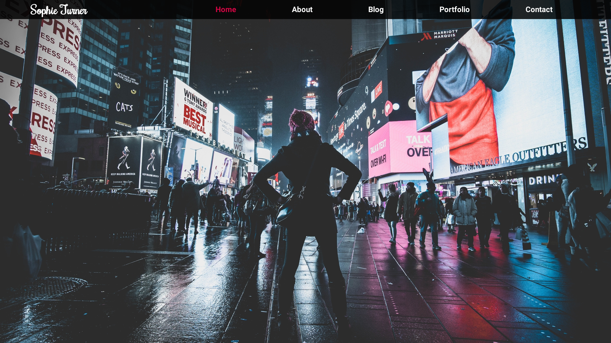

Photographer's personal portfolio + blog site. Developed in **GatsbyJS** and **Strapi** headless CMS. This project uses **GraphQL** query language. I've built a custom lightbox also.

The purpose of this project was to create personal portfolio site for a photographer. GatsbyJS was chosen for a SEO importance (blog) and Strapi CMS for user friendly GUI that can be used even by a less technical people. The FE and BE is split and hosted on Netlify and Heroku free hosting. Design is mine.

# Note
    First load of a page takes a couple of seconds due to back end being hosted on Heroku,
    which after 30 mins of inactivity shut down dynos (page is idling).

https://gatsby-blog-strapi.netlify.app/

# Used packages

I used these third party tools and packages for this project:

Client:

react
react-icons (icon pack)
GatsbyJS

Server:

Strapi
MySQL
Cloudinary

# Authors

    Mathias Handle

Free photos from [Unsplash](https://unsplash.com) were used for this project. Photo attributions can be found in client/src/assets/images/attributions.txt.

# License

    Free for use and sharing.
